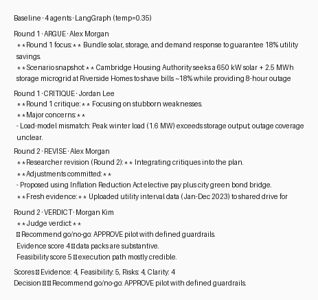
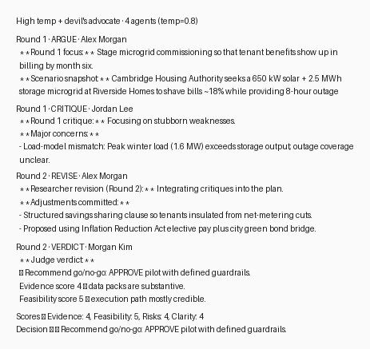

# MAS 665 HW5 — Proof that the debate stack runs locally

## Run context
- Python 3.9.6 inside `.venv` (no remote calls; deterministic local generator).
- Framework: LangGraph 0.6.10 orchestrating a custom `LocalDebateModel`.
- Memory: stateless per run (conversation state held only in LangGraph state).

## Command log
```bash
$ .venv/bin/python debate_runner.py
/Users/melo/Documents/Harvard_3/MAS 665/HW5/.venv/lib/python3.9/site-packages/urllib3/__init__.py:35: NotOpenSSLWarning: ...
🔁 Running debate: baseline_full_lowtemp — Should Cambridge approve the Riverside Homes community microgrid?
✅ Completed: baseline_full_lowtemp

🔁 Running debate: toggle_two_agent — Compact debate: researcher vs critic-judge on Riverside microgrid
✅ Completed: toggle_two_agent

🔁 Running debate: toggle_high_temp_devil — High-temperature debate with devil's advocate pressure test
✅ Completed: toggle_high_temp_devil
```

Outputs land in `results/<config>/transcript.{md,json}` plus CSV/JSON summary tables.

## Screenshots (≥2 rounds + verdict)
The PNGs below are generated directly from the transcripts and live in `deliverables/images/`.





## Config summary
| Run key | Agents | Temperature | Devil’s Advocate | Rounds | Decision | Memory |
| --- | --- | --- | --- | --- | --- | --- |
| `baseline_full_lowtemp` | Researcher → Critic → Synthesizer → Judge | 0.35 | No | 2 | Approve with guardrails | Stateless |
| `toggle_two_agent` | Researcher ↔ Critic-Judge | 0.35 | No | 2 | Approve with guardrails | Stateless |
| `toggle_high_temp_devil` | Researcher → Critic → Devil → Synthesizer → Judge | 0.80 | Yes | 2 | Approve with guardrails | Stateless |

See `results/summary.json` for rubric scores and convergence metrics.

